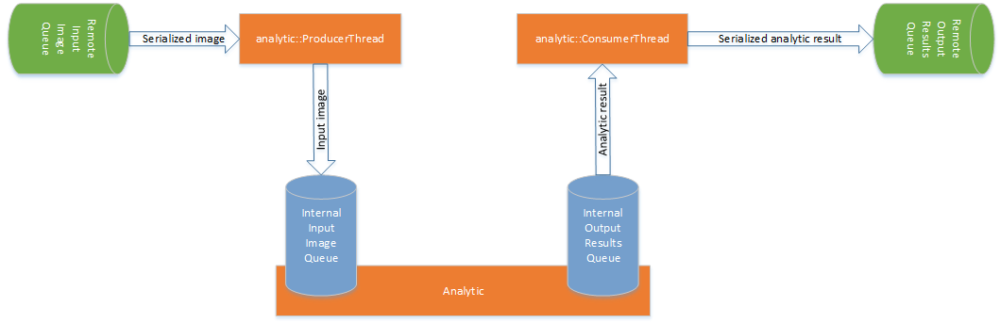

# Analytic process (Analytic instance)
The Analytic Starter starts an Analytic process / Analytic instance on the system when the OpenCCTV Server sends an Analytic start request. This Analytic Runner is that daemon process, started by the Analytic Starter.

Analytic Runner loads up required video analytic plugin (shared library) and runs it. Input images are fed into the running video analytic and analytic results (output from the analytic for each input image) are sent to the OpenCCTV server.

#### Design of Analytic process
Analytic process contains 3 threads.

1. **analytic::ProducerThread** receives serialized image objects (coming from OpenCCTV server) from the remote input image queue, de-serializes them and pushes them to internal input image queue of the Analytic plugin.
2. **Analytic** is loaded (from the shared library) by the main thread and runs it to analyze images pushed into the internal input image queue and push analytic results of each and every input image into internal output results queue.
3. **analytic::ConsumerThread** receives analytic results from the internal output results queue, serializes them and writes them into remote output results queue. These analytic results will be received by the OpenCCTV server's Analytic Results Router Threads.

